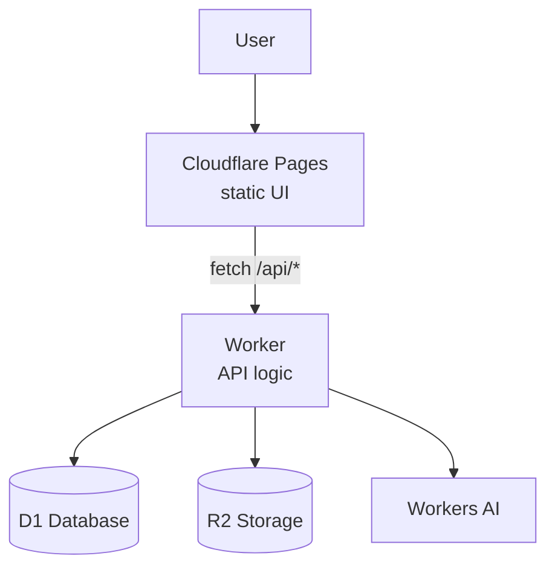
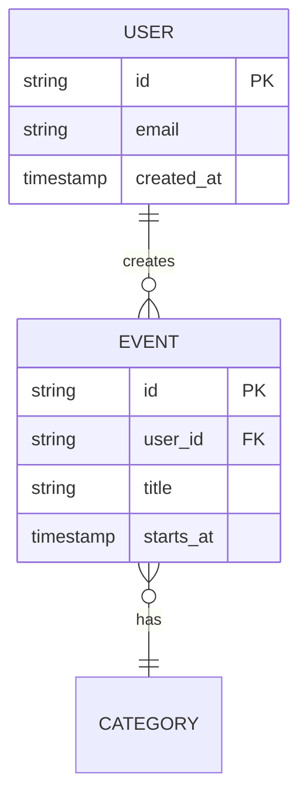

# Architecture Diagram (and Critique)

The goal is not just to produce a diagram — it's to produce a diagram the developer then critiques, finding what's wrong or missing. The critique is the learning.

## Step 1: Decide which diagram

Ask the developer, unless it's obvious from context:

- **Architecture diagram** — components and how requests flow. Best for: "how does my app work" questions, planning new features, onboarding.
- **ERD (entity relationship diagram)** — data model. Best for: database design, understanding what data the app stores.
- **Sequence diagram** — step-by-step flow of a specific user action. Best for: debugging async flows, auth flows, understanding a single feature deeply.

If they're not sure, start with architecture.

## Step 2: Produce the diagram

Read the relevant code first — don't hallucinate from memory or the PRD alone. For an architecture diagram, look at `wrangler.toml`, main entry points, and routes. For an ERD, look at migrations or schema files.

Use Mermaid syntax. Keep it readable — if it's bigger than ~15 nodes, break it into multiple diagrams or abstract sub-systems.

**Architecture template:**

**ERD template:**

Include a one-paragraph written explanation alongside the diagram. Don't make the diagram speak for itself.

## Step 3: Critique time

This is the important part. After showing the diagram, prompt the developer:

> "This is what I drew based on the code. Before you accept it — what's wrong or missing? Take 2 minutes and look critically."

Wait. Don't fill the silence.

Then ask these probes one at a time:

- "Is there any component on this diagram that isn't actually in the code?"
- "Is there anything in the code that isn't on this diagram?"
- "If [X user action] happens, does the arrow flow match what actually happens?"
- "What's missing that *should* exist — error handling, caching, auth boundaries?"

For an ERD:

- "Is every field here something we actually need?"
- "Are the relationships right? Is it actually one-to-many or is it many-to-many?"
- "What about soft deletes, audit trails, timestamps — are those on here?"

## Step 4: Update the diagram

Based on the critique, update the diagram. Save it to `docs/architecture.md` (or `docs/erd.md` for ERDs). Include:

- The diagram itself
- A one-paragraph explanation
- A "decisions" section listing 2–3 choices that shaped the design (e.g. "We put the API in a Worker rather than Pages Functions because we expect to add scheduled jobs later")

## Step 5: Make it a habit

At the end, tell the developer: regenerate this diagram at the end of every week. If it no longer matches the code, that's a signal something drifted and it's worth a 10-minute review.
